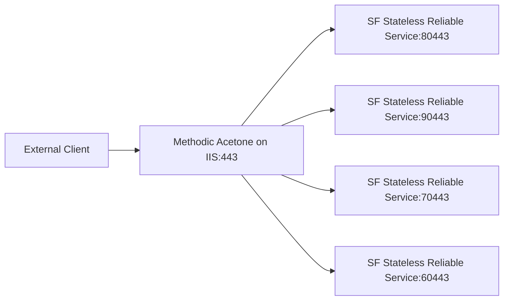

# Acetone – Detailed Technical Guide

## Introduction

### Background

**Methodic's Acetone** is a reverse proxy integration module designed specifically to work with **Microsoft Service Fabric** clusters that run on **dynamic ports** and/or **dynamic hostnames**.  
Its core purpose is to allow all services in a cluster to be accessed through **a single public SSL/TLS endpoint** (port 443) and IP address, **without directly exposing the internal services** or their randomly assigned ports.

Service Fabric does not provide an off-the-shelf IIS reverse proxy with dynamic routing based on cluster metadata, so Methodic built Acetone to solve this problem in a production-grade, reusable way.

Acetone is used in scenarios such as:
- Multi-tenant microservices clusters where services move between nodes and ports.
- Single public API endpoint mapping to multiple Service Fabric apps.
- Isolating internal cluster topology from external consumers.

### How It Works



**Lifecycle:**
1. IIS starts the `w3wp.exe` process.
2. The Acetone module is loaded and reads its configuration from IIS and Web.config.
3. Acetone connects to the Service Fabric cluster using X.509 certificate authentication.
4. Incoming HTTP requests matching the configured IIS URL Rewrite rules trigger Acetone’s resolver.
5. Acetone determines:
   - Which Service Fabric application/service to target (based on host/subdomain/URL rules).
   - The correct service endpoint host and port combination from the cluster naming service.
6. IIS rewrites the request to that resolved internal endpoint.
7. The client sees only the single external SSL endpoint.

---

## Installation

### Prerequisites – Windows Server
- **Install IIS** (`ServerManager` → `Add Roles and Features` → Web Server).
- **Install IIS Rewrite Module** ([Microsoft Download](https://www.iis.net/downloads/microsoft/url-rewrite)).
- **Install IIS Application Request Routing (ARR)** ([Download ARR](https://www.iis.net/downloads/microsoft/application-request-routing)).

### Deploying Acetone
1. Copy all Acetone DLLs to the IIS server.
2. Install the main `Methodic.Acetone.dll` into the **Global Assembly Cache (GAC)**:
   ```powershell
   gacutil /i Methodic.Acetone.dll
   ```

### IIS Setup
1. In IIS Manager, at **server level**, open the **URL Rewrite** module.
2. Click **View Providers** → **Add Provider**.
3. Name it (e.g. `Acetone`) and select **Methodic Acetone** from the *Managed Type* dropdown.
4. Press **OK**.
5. Proceed to configuration.

---

## Configuration

### General Settings

#### Cluster Connection String (`ClusterConnectionString`) – **Required**
The connection string for the Service Fabric cluster.  
Can include multiple comma-separated endpoints for HA/failover.

Example:
```
https://my-cluster-ss-lb.methodic.com:66042
```

#### Application Name Location (`ApplicationNameLocation`) – Default: `Subdomain`
Defines how the service name is extracted from the request:

- `Subdomain`: `https://mycoolservice.methodic.com`
- `SubdomainPostHyphens`: `https://uat-mycoolservice.methodic.com`
- `SubdomainPreHyphens`: `https://mycoolservice-uat.methodic.com`
- `FirstUrlFragment`: `https://uat.methodic.com/mycoolservice`

If omitted or invalid → defaults to `Subdomain`.

#### Partition Cache Limit (`PartitionCacheLimit`) – Default: `5`
Max number of cached partition endpoint entries.

#### Log Information (`LogInformation`) – Default: `False`
If `True`, logs informational messages to Windows Event Log.

---

### Credentials (X.509 Certificates)

Only X.509 certificate-based auth is currently supported.

#### **Thumbprint-based**
- `CredentialsType` = `CertificateThumbprint`
- `ClientCertificateThumbprint` → Thumbprint in `LocalMachine.My` store.
- `ServerCertificateThumbprint` → Thumbprint of Service Fabric cluster cert.

#### **Common Name-based**
- `CredentialsType` = `CertificateCommonName`
- `ClientCertificateSubjectDistinguishedName` = e.g. `CN=Methodic Global`
- `ClientCertificateIssuerDistinguishedName` = Full issuer DN.
- `ServerCertificateCommonNames` (optional) = Comma-separated CN list.

---

### Future Features
- `VersionParameter`: Query string key holding app version → used for version-specific routing.
- `ClearCacheParameter`: Query string key to force cache refresh (diagnostics).

---

## Maintenance

### Logging
If `LogInformation` is true, Acetone writes to **Windows Event Log** under its own source.

### Example IIS URL Rewrite Rule
```xml
<rewrite>
  <rules>
    <rule name="ReverseProxyInboundRule1" stopProcessing="true">
      <match url="(.*)" />
      <conditions>
        <add input="{ACETONE:{CACHE_URL}}" pattern="(.+):\/\/(.+):(\d+)" />
      </conditions>
      <action type="Rewrite" url="{C:1}://{SERVER_NAME}:{C:3}{URL}" appendQueryString="true" logRewrittenUrl="true" />
    </rule>
  </rules>
  <outboundRules>
    <rule name="ReverseProxyOutboundRule1" preCondition="ResponseIsHtml1" enabled="true">
      <match filterByTags="A, Form, Img" serverVariable="RESPONSE_Location" pattern="https:\/\/([\w.]+)(:)(\d\d\d\d\d?)(.*)?" />
      <action type="Rewrite" value="https://{R:1}:443{R:4}" replace="true" />
    </rule>
    <preConditions>
      <preCondition name="ResponseIsHtml1">
        <add input="{RESPONSE_STATUS}" pattern="3\d\d" />
      </preCondition>
    </preConditions>
  </outboundRules>
</rewrite>
```

---

## Example Scenarios

### 1. Multi-environment routing
- `uat-mycoolservice.methodic.com` → UAT instance
- `prod-mycoolservice.methodic.com` → Production instance

### 2. Partitioned services
Partition-based routing based on Service Fabric partition key.

### 3. Cache refresh
Request with `?no-cache=true` bypasses endpoint cache.

---

## Troubleshooting

| Problem | Likely Cause | Solution |
|---------|--------------|----------|
| Requests bypass Acetone | Rewrite rule misconfigured | Check `{ACETONE:{CACHE_URL}}` condition |
| 500 Internal Server Error | Cert permissions issue | Ensure IIS AppPool user has private key access |
| Cluster not found | Wrong connection string | Verify port, DNS, and firewall |
| VersionParam ignored | Feature not yet implemented | Wait for future release |

---

## Building from Source
```powershell
nuget restore Methodic.Acetone.sln
msbuild Methodic.Acetone.sln /p:Configuration=Release
```

---

## License
MIT License. See `LICENSE` file.
